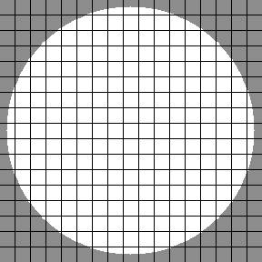
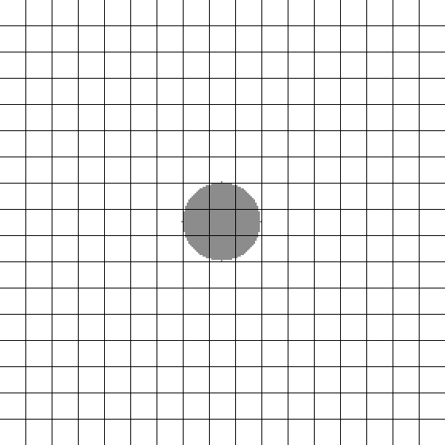
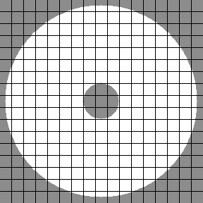
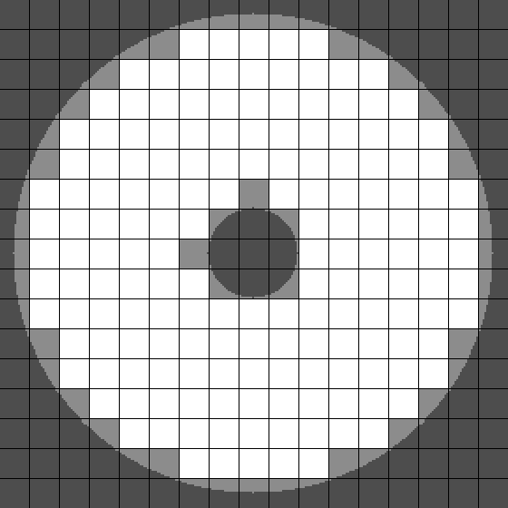

# Slimefinder

Slime finder is a command line Java tool to search for locations in a Minecraft world with specific amounts of slime chunks within certain range of a player. It was designed to look for mobfarm perimeter locations where the number of slime chunks in the perimeter is either very high or very low.

It can be run with the command:
```
java -jar slimefinder.jar <command-line-options>
```  
in the directory where ``slimefinder.jar`` is located.

The program has two possible modes, search and image generation. They are both specified by giving command line arguments. The available options are the following:

``-s``  Enters the search mode.

``-i``  Enters the image generation mode.

If both ``-s`` and ``-i`` are given the search will be performed first and the image generation immediately afterwards. 

A running task can be interupted by entering ``q`` into the terminal (stdin).

The settings for the slime finder are given in three separate property files. The files ``search.properties`` and ``image.properties`` contain settings for the search- and image generation modes, respectively and the file ``mask.properties`` contains general information that is needed in both modes. 

If a required property file does not exist a new one with default properties will be created. Any missing properties will be added and initialized with defaults.
If a property file contains properties that are not used by the slimefinder they will be ignored and deleted from the property file.

## Mask properties

The file ``mask.properties`` defines the parameters necessary in both the image generation and search modes. It has
the following fields:

| property | type | default value |
|:--- |:--- |:---|
| world-seed     | long | ``0`` |
| despawn-sphere | boolean  | ``true`` |
| exclusion sphere | boolean | ``true`` |
| y-offset | integer | ``0`` |
| chunk-weight | integer | ``0`` |

**Block mask** at position P is the set of block positions with a particular y-coordinate in which a hostile mob could spawn if a player was positioned at P. Here we restrict ourselves to inspect a single y-coordinate because slime spawning depends heavily on altitude. The block mask is what the slimefinder uses to determine which blocks around the player to check for slime chunks.

The y-coordinate is specified relative to P with the property **``y-offset``**. For example with **``y-offset=-16``**,  a mask would represent the set of block positions 16 blocks below the player where hostile mobs could spawn.

**``Despawn sphere``** is a sphere of radius 128 blocks centered around a player outside which a slime would instantly despawn. Although it probably is not of much use, you can disable the despawn sphere check by setting this property to false which would make all the blocks in the 17x17 chunk area around the player to be included.

**``Exclusion sphere``** is a sphere of radius 24 centered around a player inside which mobs cannot spawn. Disabling the exclusion sphere can be done by setting this proeprty to false, which might be needed in some cases where some player movement is needed at the center of a perimeter.

How the block mask is calculated from the mask components, despawn sphere and exclusion sphere, is illustrated below.

Shape of the mask with only despawn sphere enabled  


Shape of the mask with only exclusion sphere enabled  


Shape of the mask with both the despawn and exclusion spheres enabled  


While the block mask tells which blocks to check for slime chunks, the **chunk mask** does the same for chunks. However, a chunk being a larger region can be just partially inside the block mask. This makes it is a bit ambiguous what it means for a chunk to be in the despawn sphere for example. With the property **``chunk-weight``** you can specify how many blocks a chunk needs to have inside the corresponding block mask to be considered part of the chunk mask.

In short, a chunk mask at position P is the set of chunks for which the number of blocks inside the corresponding block mask is greater than the **``chunk-weight``**. 

How the chunk mask depends on the min-chunk-weight is illustrated below.

`chunk-weight = 0`. At least one block in each chunk is contained by the block mask.


`chunk-weight = 255`. Chunks are completely contained by the block mask.


## Search properties

The file ``search.properties`` defines the parameters necessary for the search mode. It has the following fields:

| property | type | default value |
|:--- |:--- |:---|
| append | booean | ``false`` |
| fine-search | boolean | ``false`` |
| output-file | string | ``results.csv`` |
| center-pos | coordinate | ``0c0,0c0`` |
| max-width | integer | ``1`` |
| min-width | integer | ``0`` |
| max-block-size | integer | ``73984`` |
| min-block-size | integer | ``0`` |
| max-chunk-size | integer | ``289`` |
| min-chunk-size | integer | ``0`` |

**Block size** is the number of blocks of slime chunks contained by the block mask. 
**Chunk size** is the number of slime chunks contained by the chunk mask.

In the search mode the slime finder looks for positions for which block size and chunk size are within a range specified by the properties **``min-block-size``** and **``max-block-size``** for the block size or **``min-chunk-size``** and **``max-chunk-size``** for the chunk size. For a position to matched it is enough if either its block or chunk size is within the search range.

A starting position for the search is given by specifying a position in the **``center-pos``**-field. The position can be given in either block or chunk format.  
In block format the coordinates are given in the format ``x,z``,  where ``x`` and ``z`` are the block coordinates.  
In chunk format the coordinates are given in the format ``Xcx,Zcz``,  where ``X`` and ``Z`` are the chunk coordinates and ``x`` and ``z`` are the block coordinates within the chunk.
For example the chunk coordinate ``16,33`` would be equivalent to the chunk coordinate ``1c0,2c1`` as ``16 = 16 * 1 + 0`` and ``33 = 2 * 16 + 1``.

The search will check all chunk positions in the square of width **``max-width``** centered around the starting chunk. Positions in the square of width **``min-width``** centered around the starting chunk will be skipped. The positions will be iterated through in a spiralling manner which ensures that matches are listed from closest to farthest from starting position.

If **``fine-search``** option is set to ``true`` all block positions in each chunk are checked. Otherwise only one position within each chunk is checked. 

The matching positions found are written on a file specified by the **``output-file``**-field. If the file does not exist a new one with the given name will be created if possible. Unless **``append``** is set to true an existing output file will be overwritten without a warning! The output-file can also contain a path to a directory.

Every line in the output file containing no data should either start with a # or consist of whitespace only. This is important for the file to be readable when used as an input for the image generation mode. The output file is formatted as a .csv-file with ``;`` as a delimiter. Each line in the output file describes a single position. here is an example of an output file:
```
block-position;chunk-position;blockSize;chunkSize
0,0;0c0,0c0;4005/49640;18/222
#this is a comment
```
The block and chunk coordinates are formatted in the csv-files exactly like in the **``center-pos``**-field.
The block and chunk size are the appended by the surface area of the corresponding mask, which is essentially the maximum possible size.

## image.properties

The file ``image.properties`` defines the parameters necessary for the image generation mode. It has the following fields:

| property | type | default value |
|:--- |:--- |:---|
| input-file | string | ``results.dat`` |
| output-dir | string | ``images`` |
| block-width | integer | ``1`` |
| grid-width | integer | ``1`` |
| draw-slime-chunks | boolean | ``true`` |
| draw-block-mask | boolean | ``true`` |
| draw-chunk-mask | boolean | ``true`` |
| draw-center| boolean | ``true`` |

**input-file** is the name of the file where positions to be generated into images will read from.

**output-dir** is the directory where the generated images will be placed. If the directory does not exist a new one will be created.

**block-width** and **grid-width** are the widths of a block and a gridline in pixels.

**draw-slime-chunks**, **draw-block-mask**, **draw-chunk-mask** and **draw-center** determine what features will be drawn on the image.
